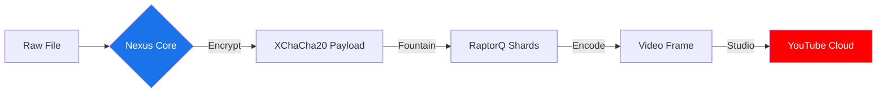
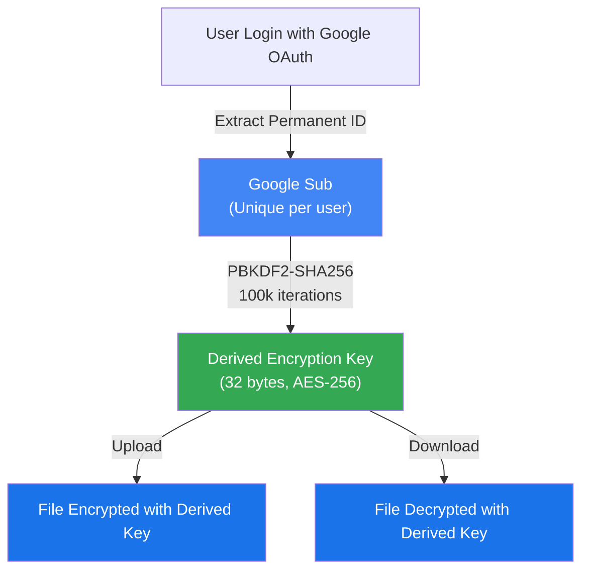

<div align="center">
  
  <h1>Nexus Storage</h1>
  <p><strong>Universal Decentralized Persistence | YouTube Refinery Architecture</strong></p>
  
  <div style="display: flex; justify-content: center; gap: 10px;">
    
    
    
  </div>
</div>

<br />

> [!IMPORTANT]
> **Nexus Storage is not a standard cloud drive.** It is a high-density archival system that abstracts the YouTube Content Delivery Network (CDN) into a raw block storage device. It provides virtually unlimited, multi-regional storage for encrypted data.

---

## 🏗️ Architectural Philosophy

Nexus is designed on the principle of **Infrastructural Parasitism**. By transforming binary data into "video" signals, we leverage the most robust, high-availability storage infrastructure on the planet without sacrificing security or privacy.

### The Micro-Service Stack
- **🛡️ Nexus Core (Rust)**: Native signal processing. Handles massive-scale encryption and Forward Error Correction (FEC) with memory-safe efficiency.
- **📡 Nexus Daemon (Go)**: The orchestration kernel. Manages the API bridge, SQLite index, and the FUSE/WebDAV virtual disk.
- **💎 Nexus GUI (Tauri)**: A premium desktop experience. Features **Floating Glassmorphism**, 18px rounded aesthetics, and real-time telemetry.

---

## 🛠️ The Nexus Pipeline: How it Works

Nexus doesn't just "upload" files; it refines them into a resilient, chromatic signal.

### 1. Data Refinement (Encryption & FEC)
Before a single byte leaves your machine, the file is sharded and wrapped in **XChaCha20-Poly1305** authenticated encryption. We then apply **RaptorQ (Fountain Codes)**: if the YouTube CDN drops frames during compression, Nexus can still reconstruct 100% of the data using the remaining fragments.

### 2. Chromatic Encoding
Data shards are mapped to high-entropy pixel grids (**YUV420p**). This "optical storage" approach ensures that even under aggressive YouTube re-encoding, the bit-density remains sufficient for bit-perfect recovery.



---

## 🔒 Security Model: Absolute Privacy

Our security model assumes the backend is **hostile**. 
- **Zero-Knowledge**: The Nexus Daemon maintains an offline Index. Filenames, folder structures, and metadata are **never** uploaded to Google.
- **Per-Shard Entropy**: Each video shard is visually indistinguishable from random chromatic noise, preventing content-analysis or automated flagging.
- **Manifest Miracles**: The global file index is sharded and mirrored in hidden playlists, allowing you to restore your entire drive from a fresh install using only your Google identity.

---

## � End-to-End Encryption: Zero-Password Architecture

Nexus v2.2.0 introduces **automatic encryption key derivation** from your Google identity—no password to remember.

### How It Works


### Key Properties
- **Automatic**: No user passwords needed. Key derives from your permanent Google identity (`sub` claim).
- **Deterministic**: Same user always gets the same encryption key across sessions and devices.
- **Back-Compatible**: Old files encrypted with custom passwords still decrypt with their override key.
- **Optional Override**: Upload files with a custom password for extra protection beyond Google sub derivation.

### Security Guarantees
| Property | Guarantee |
|:--- |:--- |
| **Brute Force Attacks** | ✅ Eliminated—no password to brute-force |
| **Key Management** | ✅ Zero server-side storage—ephemeral key per session |
| **Uniqueness per User** | ✅ Google sub is unique per user forever |
| **Backward Compatibility** | ✅ Custom passwords still override auto-derived key |

---

## �🚀 Performance & Scaling

| Feature | Specification | User Benefit |
|:--- |:--- |:--- |
| **Indexing** | SQLite FTS5 | Sub-millisecond search across TBs of data |
| **Mounting** | Rclone FUSE | Mount as a local drive (D:, Z:, /mnt/nexus) |
| **Sync** | Async Worker | Native background uploads without GUI lag |
| **Safety** | Global Mutex | CGO-level thread safety for data integrity |

---

## ⚙️ Quick Start

### Build & Execution
Nexus is cross-platform but optimized for high-performance Linux desktops.

```bash
# Clone and Initialize
git clone https://github.com/KOUSSEMON-Aurel/Nexus-Storage.git
cd Nexus-Storage

# Launch the Unified Pipeline
./run-app.sh
```

> [!TIP]
> Ensure **FFmpeg** is installed in your path. It is the critical engine for video assembly.

---

<div align="center">
  <p><i>Developed for Absolute Persistence. Built for the Decentralized Era.</i></p>
  
</div>
