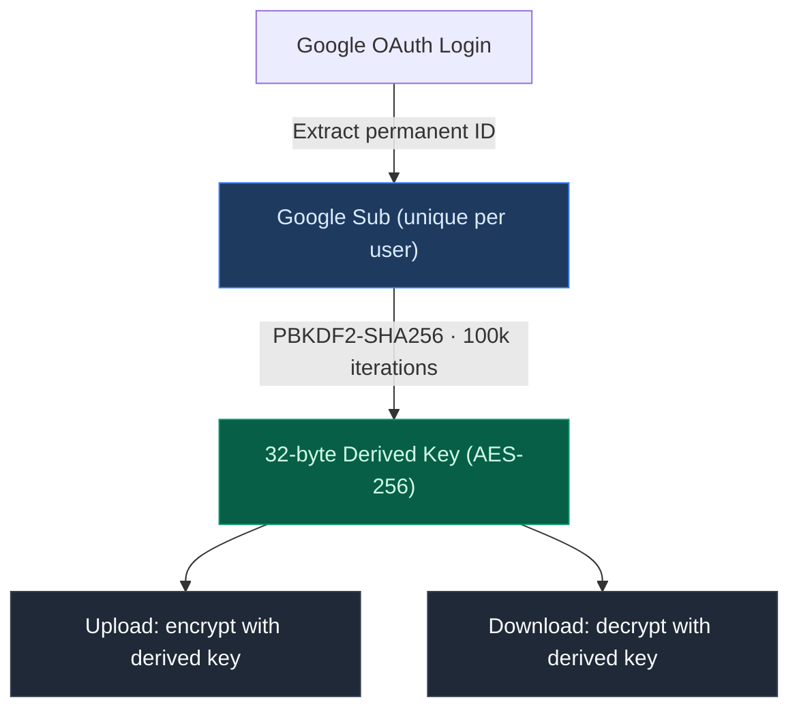

<div align="center">

<br/>

```
███╗   ██╗███████╗██╗  ██╗██╗   ██╗███████╗
████╗  ██║██╔════╝╚██╗██╔╝██║   ██║██╔════╝
██╔██╗ ██║█████╗   ╚███╔╝ ██║   ██║███████╗
██║╚██╗██║██╔══╝   ██╔██╗ ██║   ██║╚════██║
██║ ╚████║███████╗██╔╝ ██╗╚██████╔╝███████║
╚═╝  ╚═══╝╚══════╝╚═╝  ╚═╝ ╚═════╝ ╚══════╝
```

**High-Density Archival Storage — Powered by YouTube's CDN**

<br/>


<br/>

</div>

---

> **Nexus Storage is not a cloud drive.**
> It abstracts the YouTube Content Delivery Network into a raw, encrypted block storage device — leveraging the most globally redundant infrastructure on the planet, entirely for free.

---

## Overview

Most cloud storage is either expensive, limited, or surveilled. Nexus takes a different approach: **infrastructural parasitism**. By encoding binary data as chromatic noise in video frames and uploading them to private YouTube playlists, Nexus turns YouTube's CDN into a zero-knowledge, unlimited archival backend.

Your files are encrypted before they leave your machine. YouTube sees static. You get your files back perfectly.

### Recent Hardening & Improvements (v5.3.4)

The project has recently undergone a major industrial-grade hardening phase:
- **Unified Streaming Pipeline**: Integrated a stateful, memory-safe Rust framing layer that handles large data streams with minimal RAM overhead.
- **FFI Modernization**: Rewritten C-ABI bridge with strict memory ownership models, preventing leaks in cross-language boundaries (Rust ↔ Go ↔ Dart).
- **Adversarial Resilience**: Protection against bit-flip corruption and chunk reordering in the CDN via cryptographic sequential tagging.
- **Nexus Mobile (Flutter 3.x)**: Full UI modernization, zero-warning static analysis, and industrial logging integration.

---

## Architecture

Nexus is a three-layer microservice stack. Each layer has a single, well-defined responsibility.

```
┌─────────────────────────────────────────────────────────┐
│                     NEXUS GUI                           │
│              Tauri · React · Glassmorphism              │
│          Real-time telemetry · Floating panels          │
└──────────────────────┬──────────────────────────────────┘
                       │  REST API (localhost)
┌──────────────────────▼──────────────────────────────────┐
│                   NEXUS DAEMON                          │
│              Go · SQLite FTS5 · FUSE/WebDAV             │
│   Orchestration · Queue · Sync · API Bridge · Index     │
└─────────┬────────────────────────────┬──────────────────┘
          │  FFI (C ABI)               │  yt-dlp · ffmpeg
┌─────────▼────────────┐   ┌──────────▼──────────────────┐
│    NEXUS CORE        │   │      YOUTUBE CDN             │
│  Rust · XChaCha20    │   │  Private playlists           │
│  RaptorQ · YUV420p   │   │  4K WebM · Multi-region      │
│  SHA-256 · Zstd      │   │  High-availability           │
└──────────────────────┘   └─────────────────────────────┘
```

| Component        | Language      | Role                                                                 |
| ---------------- | ------------- | -------------------------------------------------------------------- |
| **Nexus Core**   | Rust          | Encryption, FEC, chromatic encoding/decoding, **Stateful Streaming** |
| **Nexus Daemon** | Go            | Orchestration, API, SQLite index, cloud sync, FUSE mount             |
| **Nexus GUI**    | Tauri + React | Desktop interface, real-time upload/download telemetry               |
| **Nexus Mobile** | Flutter       | Mobile application for Android & iOS (Modern 3.x API)                |

---

## The Pipeline

### Upload — Data Refinement

A file goes through five stages before a single byte reaches Google's servers.

```mermaid
graph LR
    A[Raw File] --> B[Zstd Compress]
    B --> C[XChaCha20-Poly1305 Encrypt]
    C --> D[RaptorQ Sharding]
    D --> E[YUV420p Chromatic Encode]
    E --> F[ffmpeg → Video]
    F --> G[YouTube API Upload]
    G --> H[Private Playlist]

    style A fill:#1F2937,color:#F9FAFB,stroke:#374151
    style C fill:#065F46,color:#D1FAE5,stroke:#059669
    style D fill:#1E3A5F,color:#DBEAFE,stroke:#3B82F6
    style E fill:#3B1F5E,color:#EDE9FE,stroke:#8B5CF6
    style H fill:#7F1D1D,color:#FEE2E2,stroke:#EF4444
```



**Chromatic Encoding — Two Modes**

| Mode     | Resolution | Density                              | Use Case                              |
| -------- | ---------- | ------------------------------------ | ------------------------------------- |
| **Base** | 720p       | 1 bit per 4×4 block (black/white)    | Maximum resilience to re-encoding     |
| **High** | 4K         | 3 bits per 4×4 block (8 grey levels) | 3× data density, WebM source required |

In Base mode, each block is either pure black or pure white — immune to YouTube's aggressive compression. In High mode, the decoder reads 8 precise luminance levels to extract 3 bits per block, requiring the original 4K WebM stream retrieved by `yt-dlp`.

### Download — Optical Recovery


The `flags=neighbor` flag in ffmpeg extraction preserves exact pixel values — without it, sub-pixel interpolation corrupts the grey levels required for High mode decoding.

---

## Security

### Threat Model

Nexus assumes the backend is **hostile**. Google can see upload timestamps and file sizes, but nothing else. The security model is designed around this assumption.

| Property                         | Implementation                                                                                                  |
| -------------------------------- | --------------------------------------------------------------------------------------------------------------- |
| **Zero-knowledge**               | Filenames, folder structures, and metadata are stored only in the local SQLite index — never uploaded to Google |
| **Content indistinguishability** | Each shard appears as random chromatic noise; automated content analysis cannot flag it                         |
| **Per-shard encryption**         | XChaCha20-Poly1305 with authenticated encryption — any tampering is detected                                    |
| **Forward Error Correction**     | RaptorQ fountain codes allow full reconstruction even if YouTube drops frames during processing                 |
| **Local index**                  | `nexus.db` is the sole source of truth for your file tree; it never touches YouTube                             |

### Zero-Password Architecture

Nexus v2.2.0 introduces automatic key derivation from your Google identity. No password to remember, no master key to store.



**Key properties:**

- **Deterministic** — Same Google account always produces the same key, across devices and sessions
- **Ephemeral** — The derived key is never stored anywhere; it is re-computed on each session
- **Override available** — Any file can be encrypted with a custom password instead; legacy files are unaffected
- **No brute-force surface** — There is no password to attack

| Threat                      | Status                                     |
| --------------------------- | ------------------------------------------ |
| Brute-force master password | Eliminated — no master password exists     |
| Key interception in transit | Impossible — key never leaves local memory |
| Google account compromise   | Attacker sees encrypted video noise only   |
| Daemon compromise           | `googleSub` never persisted to disk        |

---

## Cloud Sync

Nexus maintains a local `nexus.db` SQLite database as the file index. This database is synchronized to Google Drive as a backup and for multi-device support.

### Sync Architecture

```
LOCAL                                    REMOTE (Google Drive)
─────────────────────────────────────    ────────────────────────
nexus.db          ──── Push ─────────→   nexus.db
nexus.db-wal      (WAL checkpoint first, never pushed)
nexus.db-shm      (never pushed)
                  ←─── Pull ──────────   nexus-sync.json (manifest)
```

### Sync Protocol — Push

```
1. PRAGMA integrity_check on local DB
2. PRAGMA wal_checkpoint(TRUNCATE) → flush WAL
3. Assert: nexus.db-wal = 0 bytes
4. Assert: nexus.db-shm does not exist
5. Read remote manifest (LSN + hash)
6. LSN matrix comparison:
   ├─ local = 0           → abort (empty DB, nothing to push)
   ├─ remote > local      → abort (pull required first)
   ├─ remote = local, same hash → skip (already in sync)
   ├─ remote = local, diff hash → FATAL (conflict, manual intervention)
   └─ local > remote      → proceed
7. Calculate local SHA-256 hash
8. Upload: nexus.db.tmp → rename to nexus.db (atomic)
9. POST-PUSH VERIFICATION: re-download from Drive, compare hash
10. Update kv_store: last_push_lsn, last_push_hash (FATAL if fails)
11. Clear pending_sync table
```

### Sync Protocol — Pull

```
1. Read remote manifest
2. Check local LSN (unless force=true)
3. Assert: remote record_count > 0 (refuse empty DB)
4. Backup local DB → nexus.db.backup_pre_pull
5. Download nexus.db from Drive to temp file
6. Verify: SHA-256(temp) = manifest.HashSHA256
7. PRAGMA integrity_check on temp file
8. Assert: no .wal or .shm shadow files on temp file
9. Atomic replace: close DB → rename → reopen
10. Auto-restore from backup if reopen fails
```

### Startup State Matrix

| Local State       | Remote Backup        | Action               |
| ----------------- | -------------------- | -------------------- |
| Corrupt           | Exists               | Force pull + restore |
| Corrupt           | Missing              | Initialize fresh DB  |
| Empty (LSN = 0)   | Exists               | Pull                 |
| Empty (LSN = 0)   | Missing              | Stay empty           |
| Healthy (LSN > 0) | Remote newer         | Pull                 |
| Healthy (LSN > 0) | Local newer or equal | Stay local           |

**Network resilience:** All Drive operations run with a 60s timeout and exponential backoff retry (up to 3 attempts: 1s, 2s, 4s delays). The daemon will never hang indefinitely on a network failure.

---

## Performance

| Feature              | Specification           | Benefit                                                 |
| -------------------- | ----------------------- | ------------------------------------------------------- |
| **File search**      | SQLite FTS5 full-text   | Sub-millisecond search across terabytes of indexed data |
| **Virtual mount**    | Rclone FUSE / WebDAV    | Mount as a local drive (`D:`, `Z:`, `/mnt/nexus`)       |
| **Background sync**  | Async worker queue      | Uploads and downloads run without blocking the GUI      |
| **Thread safety**    | Global mutex (CGO)      | Concurrent access from GUI, CLI, and daemon is safe     |
| **Frame extraction** | ffmpeg `flags=neighbor` | Pixel-perfect High mode recovery                        |
| **4K source**        | yt-dlp WebM             | Only WebM preserves full 4K grey levels from YouTube    |

---

## Quick Start

### Prerequisites

- [FFmpeg](https://ffmpeg.org/) — video assembly and frame extraction
- [Rclone](https://rclone.org/) — virtual disk mounting (optional)
- A Google account with YouTube Data API v3 access

### Build & Run

```bash
# Clone
git clone https://github.com/KOUSSEMON-Aurel/Nexus-Storage.git
cd Nexus-Storage

# Launch the unified pipeline (builds Core + Daemon + GUI)
./run-app.sh
```

The daemon starts on `localhost:8080` and the Tauri GUI launches automatically.

### CLI Usage

```bash
# Trigger cloud sync
nexus sync

# Upload a file
nexus upload /path/to/file.zip

# Download by filename
nexus download archive.zip

# Mount as virtual drive
nexus mount /mnt/nexus
```

---

## Project Structure

```
Nexus-Storage/
├── nexus-core/          # Rust — encryption, FEC, video encode/decode
│   └── src/
│       ├── decoder.rs   # Luminance scan, bit reconstruction
│       ├── ffi.rs       # C ABI bridge to Go daemon (panic-safe)
│       └── hasher.rs    # SHA-256, XXH3-128
├── nexus-daemon/        # Go — orchestration, API, sync, queue
│   ├── api.go           # REST endpoints
│   ├── db.go            # SQLite schema, LSN tracking, WAL
│   ├── queue.go         # Upload/download worker queue
│   ├── recovery.go      # Backup and restore logic
│   ├── sync.go          # Cloud sync protocol (push/pull)
│   └── youtube_auth.go  # OAuth2, sub extraction, key derivation
├── nexus-gui/           # Tauri + React — desktop interface
│   └── src/
│       └── Dashboard.tsx
├── nexus-cli/           # Rust CLI client
└── run-app.sh           # Unified build and launch script
```

---

## Encoding Specification

| Parameter          | Base Mode     | High Mode              |
| ------------------ | ------------- | ---------------------- |
| Resolution         | 1280×720      | 3840×2160 (4K)         |
| Block size         | 4×4 pixels    | 4×4 pixels             |
| Bits per block     | 1             | 3                      |
| Encoding           | Black / White | 8 grey levels          |
| Download format    | Any           | WebM 4K only           |
| YouTube resilience | Maximum       | Requires source stream |

---

<div align="center">

**Nexus Storage** · Designed for absolute persistence

*A YouTube playlist. A cryptographic fortress. A local drive.*


</div>
