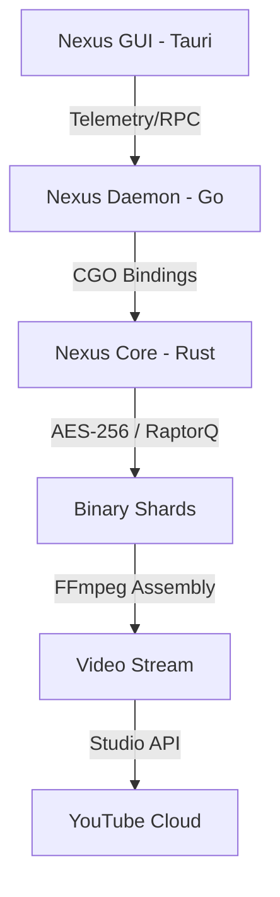
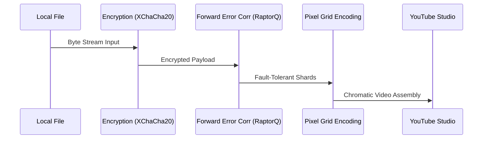
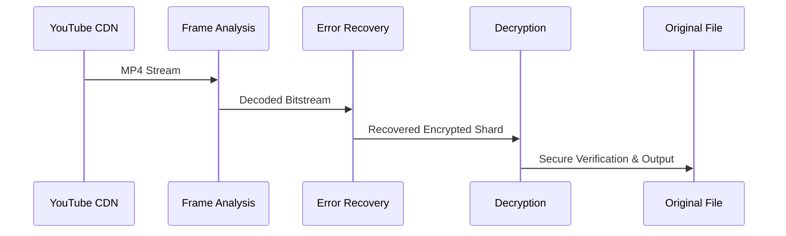

<div align="center">
  
  
  
</div>

<br />

<div align="center">
  <h1>Nexus Storage</h1>
  <p><strong>Universal Decentralized Persistence through High-Density Video Archival</strong></p>
  <p><i>A professional-grade, encrypted cloud storage system utilizing YouTube's global infrastructure as a high-resilience block storage backend.</i></p>
</div>

---

## Overview

Nexus Storage transforms binary data into high-entropy video streams, achieving virtually unlimited capacity with multi-regional redundancy. By abstracting the "video" layer into a raw block storage device, Nexus allows for traditional file management workflows while benefiting from the most robust content delivery network on the planet.

## 🏗️ System Architecture

Nexus follows a decoupled, three-tier architecture designed for maximum performance and native operating system integration.



### Core Components
- **[Rust] Nexus Core**: The cryptographic and signal processing engine. Handles **XChaCha20-Poly1305** authenticated encryption and **RaptorQ** fountain code error correction.
- **[Go] Nexus Daemon**: The orchestration layer. Manages the OAuth2 lifecycle, maintains a local **SQLite FTS5** metadata index, and provides a binary bridge for **Rclone** FUSE mounts.
- **[Tauri] Nexus GUI**: The high-fidelity desktop dashboard. Features real-time quota monitoring, live sync telemetry, and an optimized startup sequence with **Skeleton Loaders**.

---

## 🛰️ The Nexus Pipeline

The transition from a local file to a cloud-stored video shard involves multiple layers of data transformation to ensure zero-loss recovery and maximum security.

### 📤 Upload & Compression


### 📥 Download & Reconstitution


---

## 🔒 Technical Specifications

### Security & Privacy
- **Client-Side Only**: All encryption happens on-machine. Google never sees raw bytes, filenames, or folder structures.
- **Content-Addressability**: SHA-256 deduplication prevents redundant uploads, saving bandwidth and API quota.
- **Manifest Resilience**: Periodic metadata snapshots are sharded and mirrored across dedicated playlists for full disaster recovery.

### Universal Integration
- **Virtual Disk**: Mount Nexus as a native drive (**Dolphin, Nautilus, Explorer**) via the built-in Rclone bridge.
- **Real-time Search**: Sub-millisecond discovery across millions of shards using SQLite Full-Text Search.
- **Branding**: Professional startup sequence with a 2-second security gate to ensure session integrity.

---

## 🛠️ Installation & Setup

### Prerequisites
- **Go** (1.21+), **Rust** (Stable), **Node.js** (v18+)
- **FFmpeg**: Required for signal-to-video transitions.

### Quick Start
1. Place your Google `client_secret.json` in `~/.config/nexus-storage/`.
2. Run the unified launcher:
   ```bash
   chmod +x run-app.sh
   ./run-app.sh
   ```

---

<div align="center">
  <p><i>Nexus Storage: Redefining Persistence.</i></p>
</div>
